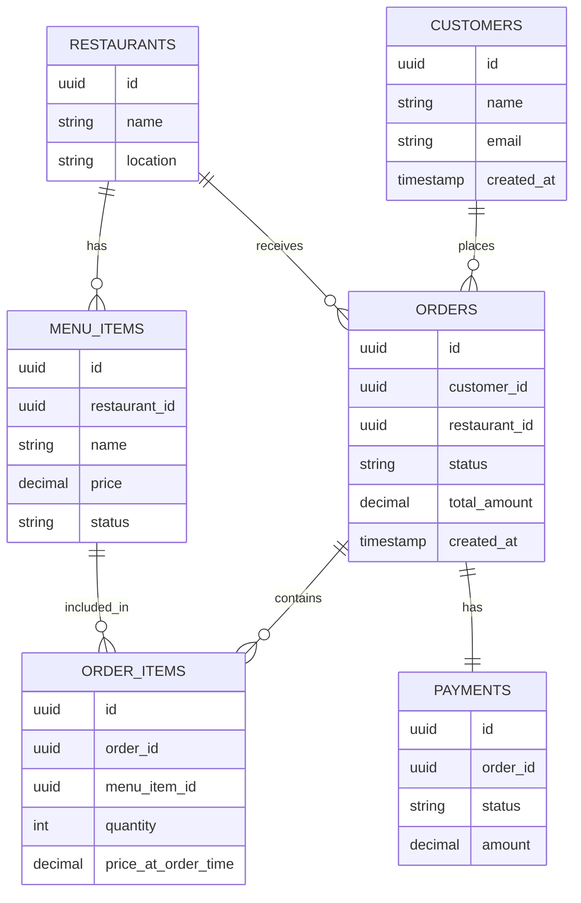
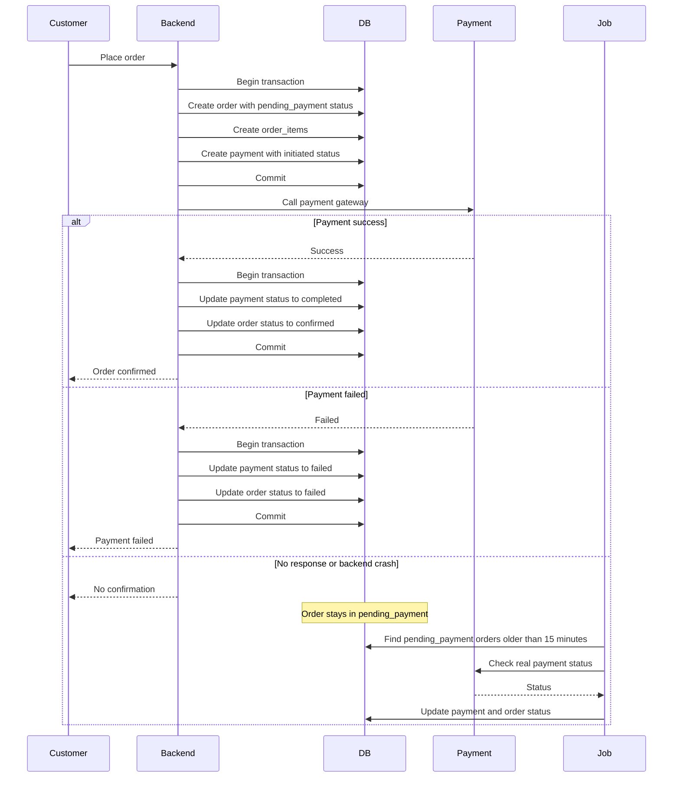
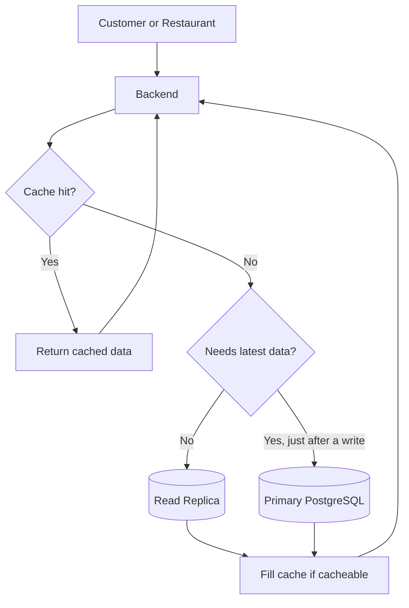
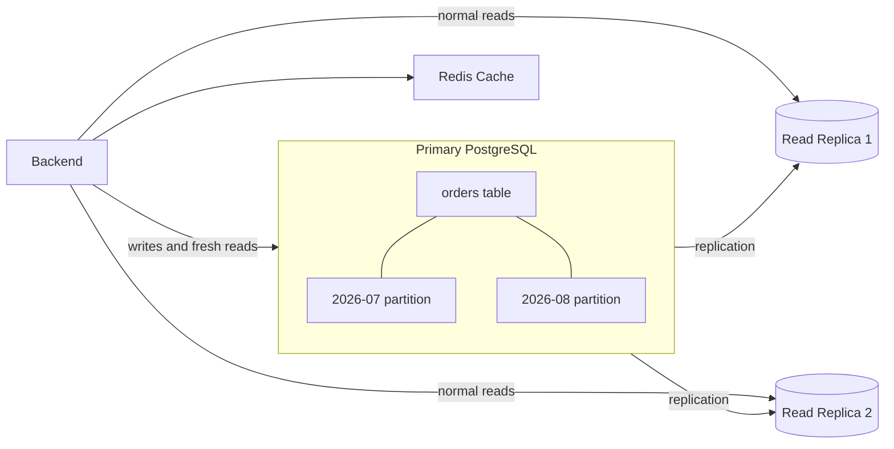

# Diagrams

## Data Model Diagram

## Order Creation Flow

## Common Read Flow

Menus and restaurant details are cacheable. Payment status is not cached, and a
read right after a write goes to the primary database.

## Scaling View

Partitioning the orders table is a later step, not day one.
