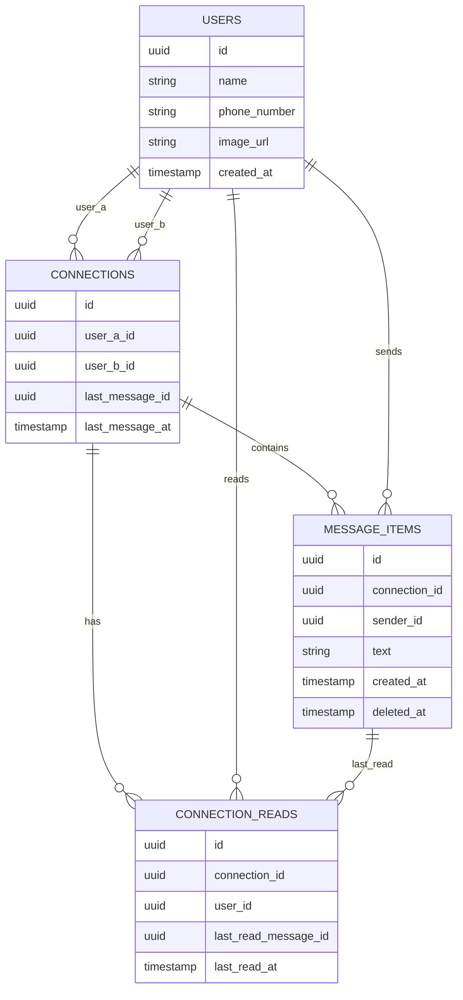
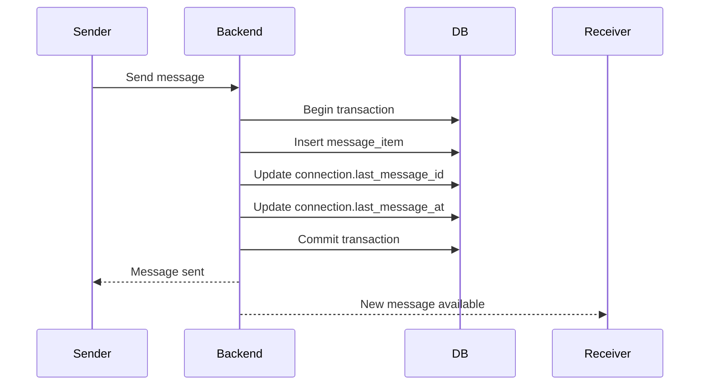
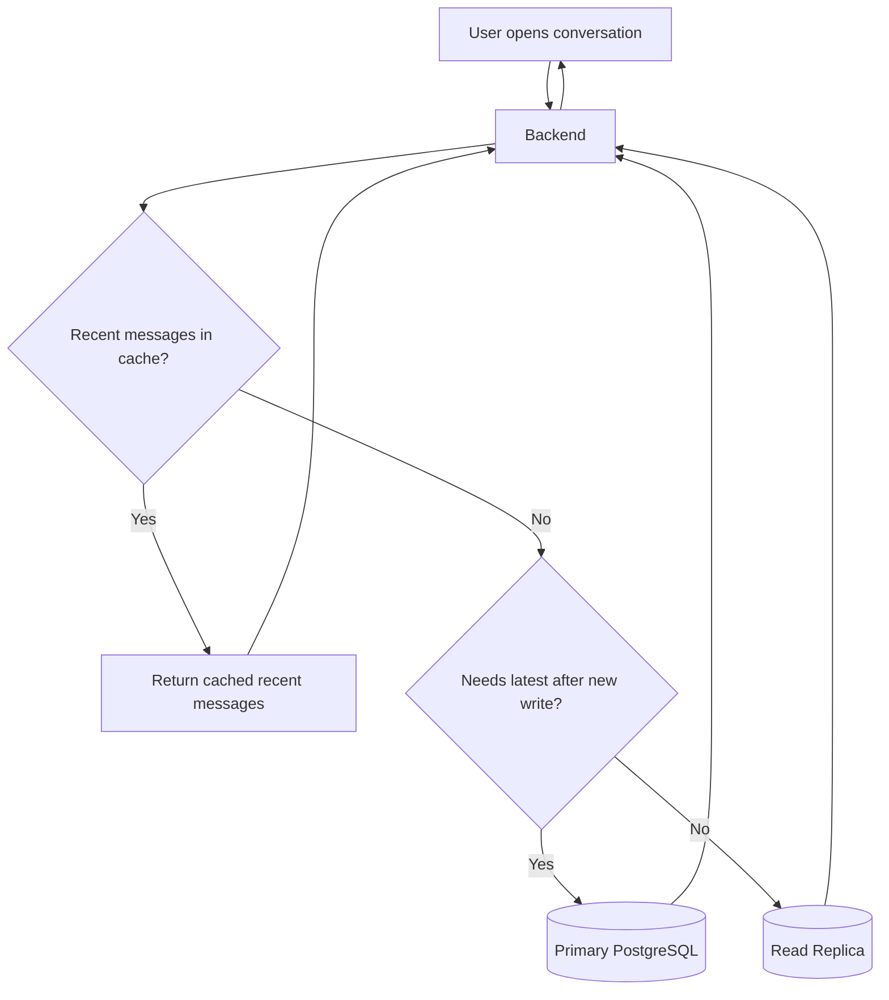
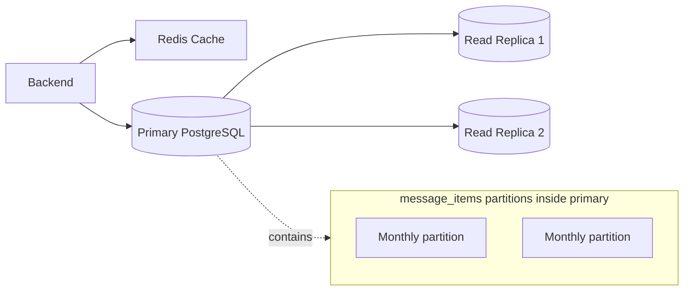

# Diagrams

## Data Model Diagram

```mermaid
erDiagram
  USERS ||--o{ CONNECTIONS : user_a
  USERS ||--o{ CONNECTIONS : user_b
  CONNECTIONS ||--o{ MESSAGE_ITEMS : contains
  USERS ||--o{ MESSAGE_ITEMS : sends
  CONNECTIONS ||--o{ CONNECTION_READS : has
  USERS ||--o{ CONNECTION_READS : reads
  MESSAGE_ITEMS ||--o{ CONNECTION_READS : last_read

  USERS {
    uuid id
    string name
    string phone_number
    string image_url
    timestamp created_at
  }

  CONNECTIONS {
    uuid id
    uuid user_a_id
    uuid user_b_id
    uuid last_message_id
    timestamp last_message_at
  }

  MESSAGE_ITEMS {
    uuid id
    uuid connection_id
    uuid sender_id
    string text
    timestamp created_at
    timestamp deleted_at
  }

  CONNECTION_READS {
    uuid id
    uuid connection_id
    uuid user_id
    uuid last_read_message_id
    timestamp last_read_at
  }
```

## Send Message Flow

```mermaid
sequenceDiagram
  participant Sender
  participant Backend
  participant DB
  participant Receiver

  Sender->>Backend: Send message
  Backend->>DB: Begin transaction
  Backend->>DB: Insert message_item
  Backend->>DB: Update connection.last_message_id
  Backend->>DB: Update connection.last_message_at
  Backend->>DB: Commit transaction
  Backend-->>Sender: Message sent
  Backend-->>Receiver: New message available
```

## Conversation Read Flow

```mermaid
flowchart TD
  User[User opens conversation] --> Backend[Backend]
  Backend --> Cache{Recent messages in cache?}
  Cache -->|Yes| Cached[Return cached recent messages]
  Cache -->|No| Fresh{Needs latest after new write?}
  Fresh -->|Yes| Primary[(Primary PostgreSQL)]
  Fresh -->|No| Replica[(Read Replica)]
  Primary --> Backend
  Replica --> Backend
  Cached --> Backend
  Backend --> User
```

## Scaling View

```mermaid
flowchart LR
  Backend[Backend] --> Redis[Redis Cache]
  Backend --> Primary[(Primary PostgreSQL)]
  Primary --> Replica1[(Read Replica 1)]
  Primary --> Replica2[(Read Replica 2)]

  subgraph MessagePartitions[message_items partitions inside primary]
    P1[Monthly partition]
    P2[Monthly partition]
  end

  Primary -. contains .-> MessagePartitions
```
