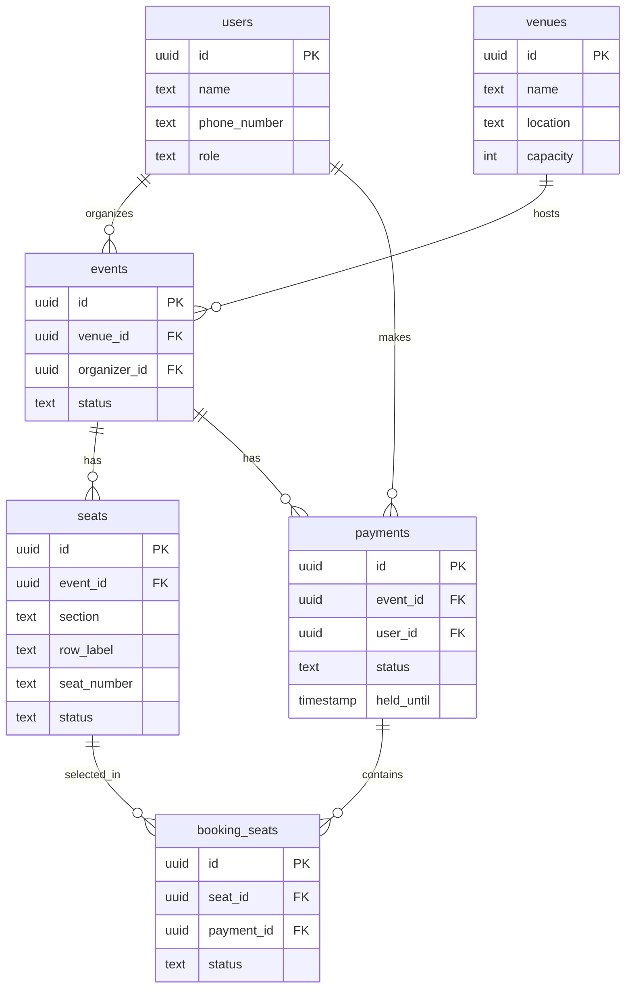
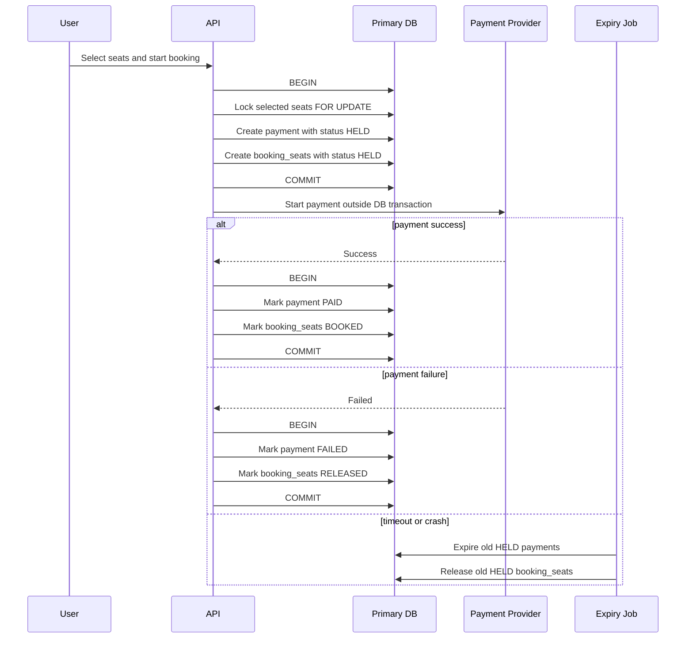
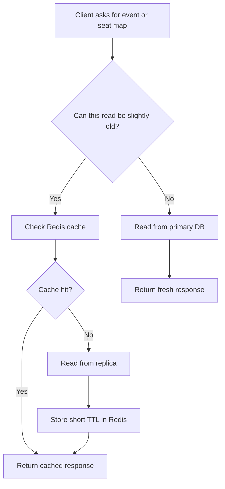
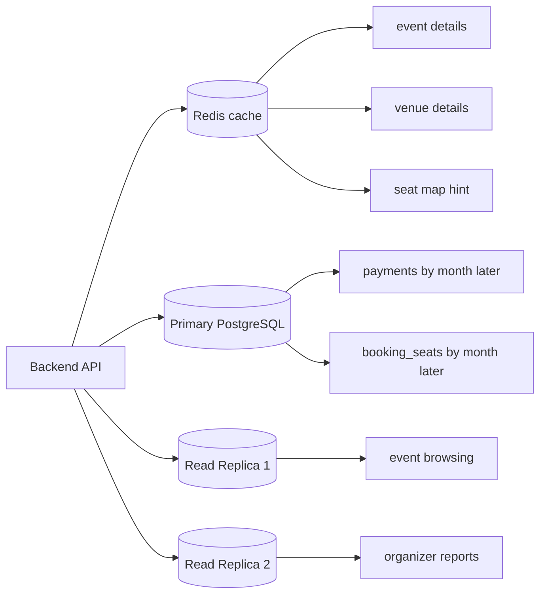

# Diagrams

## Table Relationships

```mermaid
erDiagram
  users ||--o{ events : organizes
  venues ||--o{ events : hosts
  events ||--o{ seats : has
  events ||--o{ payments : has
  users ||--o{ payments : makes
  payments ||--o{ booking_seats : contains
  seats ||--o{ booking_seats : selected_in

  users {
    uuid id PK
    text name
    text phone_number
    text role
  }

  venues {
    uuid id PK
    text name
    text location
    int capacity
  }

  events {
    uuid id PK
    uuid venue_id FK
    uuid organizer_id FK
    text status
  }

  seats {
    uuid id PK
    uuid event_id FK
    text section
    text row_label
    text seat_number
    text status
  }

  payments {
    uuid id PK
    uuid event_id FK
    uuid user_id FK
    text status
    timestamp held_until
  }

  booking_seats {
    uuid id PK
    uuid seat_id FK
    uuid payment_id FK
    text status
  }
```

## Booking Flow

```mermaid
sequenceDiagram
  participant User
  participant API
  participant DB as Primary DB
  participant Pay as Payment Provider
  participant Job as Expiry Job

  User->>API: Select seats and start booking
  API->>DB: BEGIN
  API->>DB: Lock selected seats FOR UPDATE
  API->>DB: Create payment with status HELD
  API->>DB: Create booking_seats with status HELD
  API->>DB: COMMIT

  API->>Pay: Start payment outside DB transaction

  alt payment success
    Pay-->>API: Success
    API->>DB: BEGIN
    API->>DB: Mark payment PAID
    API->>DB: Mark booking_seats BOOKED
    API->>DB: COMMIT
  else payment failure
    Pay-->>API: Failed
    API->>DB: BEGIN
    API->>DB: Mark payment FAILED
    API->>DB: Mark booking_seats RELEASED
    API->>DB: COMMIT
  else timeout or crash
    Job->>DB: Expire old HELD payments
    Job->>DB: Release old HELD booking_seats
  end
```

## Read Flow

```mermaid
flowchart TD
  A[Client asks for event or seat map] --> B{Can this read be slightly old?}
  B -->|Yes| C[Check Redis cache]
  C --> D{Cache hit?}
  D -->|Yes| E[Return cached response]
  D -->|No| F[Read from replica]
  F --> G[Store short TTL in Redis]
  G --> E
  B -->|No| H[Read from primary DB]
  H --> I[Return fresh response]
```

## Scaling View

```mermaid
flowchart LR
  API[Backend API] --> Redis[(Redis cache)]
  API --> Primary[(Primary PostgreSQL)]
  API --> R1[(Read Replica 1)]
  API --> R2[(Read Replica 2)]

  Primary --> P1[payments by month later]
  Primary --> P2[booking_seats by month later]

  Redis --> C1[event details]
  Redis --> C2[venue details]
  Redis --> C3[seat map hint]

  R1 --> Q1[event browsing]
  R2 --> Q2[organizer reports]
```
