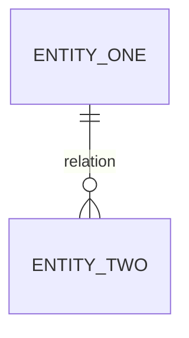
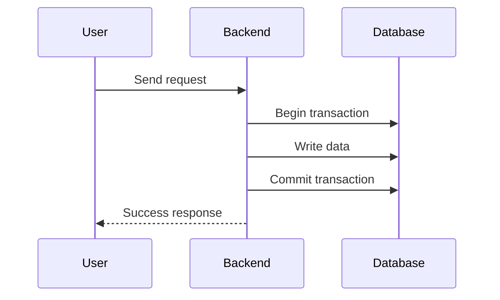
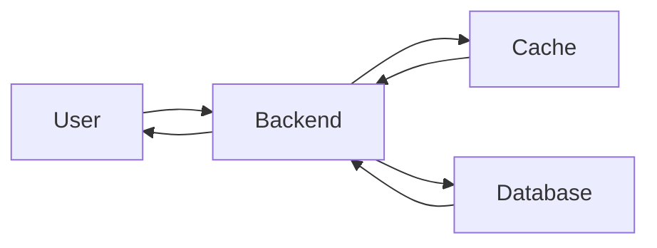
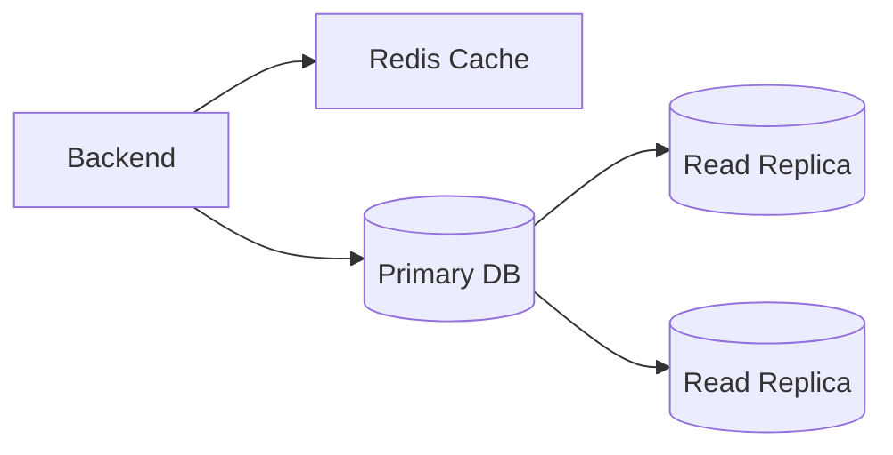

# Diagrams

## Data Model Diagram

Use this section for the ER diagram.

## Important Write Flow

Use this section for flows where multiple writes must happen correctly.

## Important Read Flow

Use this section for common read requests.

## Scaling View

Use this section only if cache, replicas, partitioning, or sharding are part of the design.

